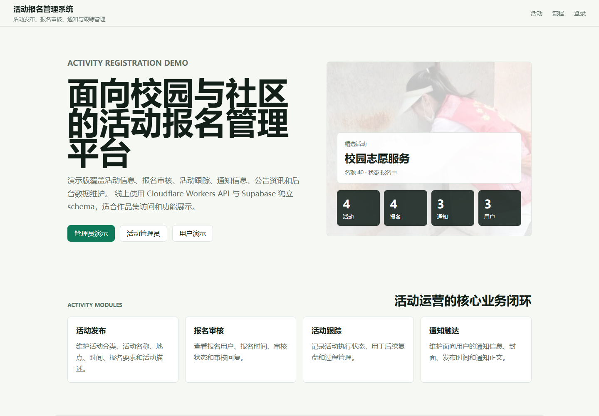
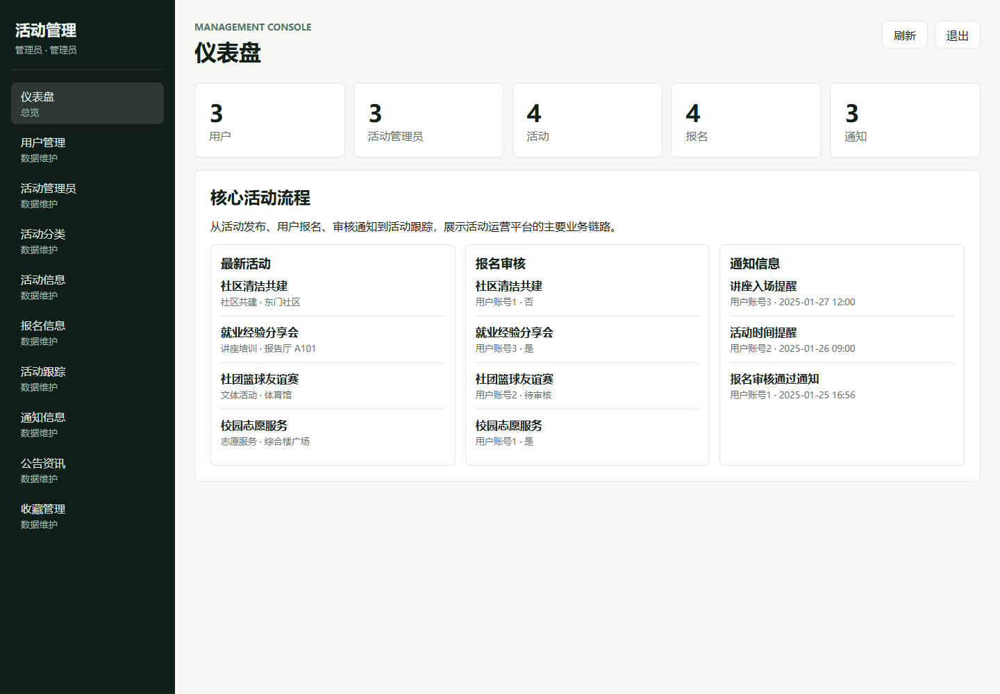
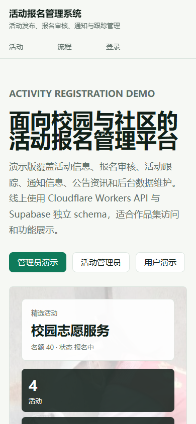

# 活动报名管理系统

面向校园、社团与社区活动运营的活动报名管理演示系统，覆盖活动发布、报名审核、活动跟踪、通知、资讯和后台数据维护。

[](https://ot-ssmw7150cne.pages.dev)


## 在线演示

| 项目 | 地址 |
|---|---|
| GitHub 仓库 | https://github.com/Nemo-netone/ot-ssmw7150cne |
| 演示地址 | https://ot-ssmw7150cne.pages.dev |
| 生产分支 | `main` |
| Cloudflare Pages | `ot-ssmw7150cne` |
| API 运行时 | Cloudflare Pages Functions / `site/_worker.js` |
| Supabase schema | `ot_ssmw7150cne` |

## 演示账号

| 角色 | 账号 | 密码 | 用途 |
|---|---|---|---|
| 管理员 | `admin` | `admin` | 查看仪表盘和维护全部演示数据 |
| 普通用户 | `用户账号1` | `123456` | 演示活动报名、通知和用户侧数据 |
| 活动管理员 | `管理账号1` | `123456` | 演示活动维护、报名审核和活动跟踪 |

这些账号只用于公开演示。不要录入真实手机号、身份证、真实地址或敏感业务数据。

## 截图

| 首页 | 管理后台 | 移动端 |
|---|---|---|
|  |  |  |

## 功能范围

- 活动运营：活动分类、活动信息、活动地点、报名人数、开始结束时间和活动描述维护。
- 报名审核：报名记录、用户信息、审核状态、审核回复和跨表活动关联。
- 活动跟踪：活动状态、活动图片和执行进度记录。
- 通知信息：面向用户的通知标题、封面、通知时间和正文内容。
- 内容展示：公告资讯、资讯分类、收藏记录和活动评论数据结构。
- 后台控制台：统一表格、搜索、新增、编辑、删除和仪表盘统计。

详细功能树见 [docs/features.md](docs/features.md)，演示账号见 [docs/accounts.md](docs/accounts.md)。

## 技术结构

当前仓库保留原始 SSM Java Web 项目资料，同时新增适合线上稳定访问的演示部署层。

| 层级 | 当前线上实现 | 说明 |
|---|---|---|
| 前端 | `site/` 静态 SPA | Cloudflare Pages 托管 |
| API | `site/_worker.js` 与 `worker/src/index.js` | Cloudflare Pages Functions 同域接口 |
| 数据库 | `supabase/schema.sql` | Supabase 独立 schema `ot_ssmw7150cne` |
| 原项目 | `src/` | SSM、MyBatis、Vue 2 前后台源码 |

线上调用链：

```text
浏览器
  -> Cloudflare Pages: site/index.html, site/app.js, site/styles.css
  -> Pages Functions / Worker: /api/*
  -> Supabase RPC: public.ot_ssmw7150cne_rest
  -> Supabase schema: ot_ssmw7150cne
```

## 本地运行

只预览线上 API 版前端：

```powershell
python -m http.server 4173 -d site
```

访问：

```text
http://localhost:4173
```

本地调试 Worker：

```powershell
npx wrangler@3 pages dev site
```

## 环境变量

Cloudflare Pages / Worker 需要配置：

```text
SUPABASE_URL=<supabase-url>
SUPABASE_SERVICE_ROLE_KEY=<supabase-service-role-key>
SUPABASE_SCHEMA=ot_ssmw7150cne
CORS_ALLOWED_ORIGINS=https://ot-ssmw7150cne.pages.dev
```

真实密钥只能放在 Cloudflare secrets 或本地受控环境里，不能写入仓库。

## 部署说明

部署事实、命令、验证记录和限制见 [docs/deployment.md](docs/deployment.md)。后续发布继续使用：

- GitHub 仓库：`ot-ssmw7150cne`
- Cloudflare Pages 项目：`ot-ssmw7150cne`
- 生产分支：`main`
- 稳定地址：`https://ot-ssmw7150cne.pages.dev`

## 已知限制

- 线上演示使用 Cloudflare Worker API 兼容层，不直接运行原 SSM/Tomcat 后端。
- 当前数据是脱敏演示种子数据，适合作品集展示，不作为生产系统使用。
- 上传文件在演示版中使用 `site/upload/` 静态资源；生产化应接入 Supabase Storage 或 Cloudflare R2。
- 地图、百度工具、验证码和原项目本地文件上传能力不作为公开演示功能。

## 许可

本项目使用 PolyForm Noncommercial License 1.0.0。允许非商业学习、演示和修改；商业使用需要获得作者额外授权。

